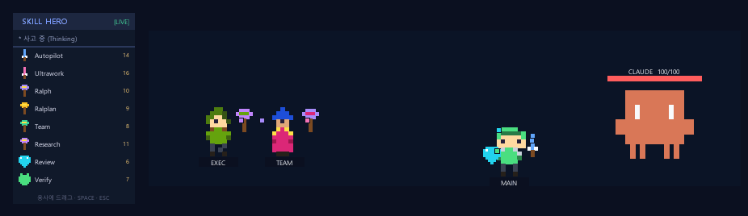

# ⚔ Skill Hero — Claude Pixel Visualizer

<p align="center">
  
</p>

<p align="center"><b>English</b> · <a href="#korean">한국어</a></p>

**A visualizer that turns Claude's work into a pixel-art RPG battle.**
Whatever Claude is doing right now (thinking · running a tool · building) appears as a **Claude-shaped invader enemy**,
and your **pixel heroes — equipped with your skills (weapons & armor) — defeat it in real time.** When the work finishes: **CLEAR!**

### What it does
- 🎮 **Claude's work = a live battle** — linked to Claude via hooks. Every tool use chips the enemy's HP, and on `Stop` the heroes land a finishing blow → **CLEAR**
- ⚔ **Equip skills as gear** — real skills like `autopilot · ultrawork · ralph · verify …` are drawn as swords/staves/armor/shields. **Drag** them onto a hero to equip (multiple skills orbit the hero as gems)
- 🧙 **Multi-agent = multiple heroes** — spawning subagents (Task) adds class-based heroes (**knight · archer · mage**) that fight together
- 🖥 **Runs anywhere** — `/skill-hero` opens the visualizer in your **local browser**; works over **SSH/remote** via VS Code port-forwarding. Optional native desktop overlay for local use. Installs as a Claude Code **plugin** (hooks auto-apply)
- 📦 **Zero dependencies** — browser / Python standard library only; runs as-is, no install

```
skill-hero.html          ← Visualizer UI (served to your browser, or embedded as a widget)
skill-hero-serve.py      ← Local server: serves the UI + live state (works over SSH via port-forward)
skill-hero-overlay.pyw   ← Optional native desktop overlay (local only · always-on-top · transparent)
skill-hero-hook.py       ← Claude Code events → state-file bridge hook
.claude-plugin/          ← plugin / marketplace manifests (plugin.json, marketplace.json)
hooks/hooks.json         ← hooks that auto-apply when the plugin is installed
commands/skill-hero.md   ← the /skill-hero command (opens the browser visualizer)
```

> This folder **is a Claude Code plugin** — installing it auto-applies the hooks (see "Live link" below).

---

## Three ways to display

| Way | Where it shows | Run |
|-----|----------------|-----|
| **A. Standalone HTML** | A browser window | double-click `skill-hero.html` |
| **B. Claude Desktop embed** | **Inside a chat message** (inline card) | render as a widget/artifact |
| **C. Claude Desktop overlay** | **Floating over the app**, covering the chat | double-click `skill-hero-overlay.pyw` (or `/skill-hero`) |

B and C differ: **B** is a card embedded in the conversation; **C** is the floating overlay where "**heroes fight on top of the chat**".

## A. Standalone HTML (browser)
Double-click `skill-hero.html`. No install/server. A demo battle plays automatically.
- **Drag** a skill card from the left **equipment panel** onto a hero to equip (clicking a card = hero #1)
- Equipping a weapon swaps the held weapon (sword/staff/bow); position changes per weapon type
- Equipping armor (Verify) / shield (Code Review) changes the body/helmet color and adds a shield
- Multiple skills orbit the hero as non-overlapping gems
- Click a chip in the bottom loadout to unequip

## B. Claude Desktop embed (widget)
Render `skill-hero.html`'s contents as a widget/artifact to run it inside a chat message. In the sandbox it runs in **demo mode** (or **drag & drop** a state JSON file onto it for a one-shot update).

## C. Claude Desktop overlay (.pyw) — ★ fight over the chat
```
double-click skill-hero-overlay.pyw   (or)   pythonw skill-hero-overlay.pyw
```
**Two always-on-top windows** float over Claude Desktop (Windows transparency feature):
- **Menu + Equipment window** (starts top-left, **movable**): the `⚔ SKILL HERO [mode] ◈ phase` menu and the skill inventory are **one panel**. Drag its **title bar** to move it.
- **Battle window** (**movable**, transparent): contains **only the characters** (heroes + Claude invader). Drag a **character** to move it.
- The battle window's transparent area is **click-through**, so you keep using the chat underneath.

| Action | Effect |
|--------|--------|
| Drag a skill → onto a battle hero | equip skill (weapon/armor), cross-window drag |
| Drag the **menu title bar** | move the menu + equipment window |
| Drag a **battle character** | move the battle window |
| **Right-click** a hero | unequip one item |
| **SPACE** | toggle Demo ↔ LIVE |
| **ESC** | quit (both windows) |

Default is a demo battle. Press **SPACE** for LIVE: it polls `~/.claude/skill-hero-state.json` once a second and mirrors real Claude activity.

---

## Live link (hooks)
The shared state path is **`~/.claude/skill-hero-state.json`** (override with the `SKILL_HERO_STATE` env var). The hook writes it; the overlay/HTML read it.

### 1) Install the hook — two options

**Option A — Install as a plugin (recommended, automatic):** this folder is a Claude Code **plugin**; enabling it **auto-applies** the hooks (no settings.json editing).
```
# for others to install
/plugin marketplace add Ign0reLee/SKILL-HERO
/plugin install skill-hero@skill-hero-marketplace
# (mid-session: /reload-plugins)
```
Installing gives you two things automatically: **(1) hooks auto-applied**, and **(2) the `/skill-hero` command** that starts the local server and opens the visualizer in your browser.
```
/skill-hero        # local: opens your browser. SSH/remote: open http://localhost:8777 locally (VS Code forwards it)
```
Plugin layout: `.claude-plugin/{plugin.json, marketplace.json}`, `hooks/hooks.json`, `commands/skill-hero.md`. Hooks & command use `${CLAUDE_PLUGIN_ROOT}` so they work regardless of install location.

#### Remote / SSH (VS Code Remote-SSH)
When Claude Code runs on a remote box, the **UI must run on your local machine**. The browser path handles this:
1. `/skill-hero` starts `skill-hero-serve.py` on the remote (port 8777) and the hook writes state there.
2. VS Code **auto-forwards port 8777** (if not, add it in the **Ports** panel).
3. Open **`http://localhost:8777` in your local browser** → it auto-connects LIVE and mirrors the remote work.

The native tkinter overlay can't display from remote to local — use the browser path above. (To run the native overlay locally against remote state: launch `skill-hero-overlay.pyw` on your PC with `SKILL_HERO_STATE_URL=http://localhost:8777/skill-hero-state.json`.)

**Option B — Manual settings.json** (on your own machine): add to `hooks` in `~/.claude/settings.json` (absolute path for your env), for events `UserPromptSubmit`, `PreToolUse` (matcher `*`), `PostToolUse` (matcher `*`), `Stop`, each running `python3 "<...>/skill-hero-hook.py"`.

> ⚠️ **Don't use Option A and B at the same time** — the hook runs twice and the enemy HP drops double. Pick one.

**OS compatibility (automatic):** the plugin hook calls `python3` — standard on macOS/Linux and present via the default alias on Windows 10/11, so no per-OS edits. (On a rare Windows without the `python3` alias, change `python3` → `python` in `hooks/hooks.json`.)

### 2) Connect the visualizer to LIVE
- **Overlay (C):** run it, press **SPACE** → polls `~/.claude/skill-hero-state.json`
- **HTML (A) via file://:** click **[LIVE 연결]** → pick `~/.claude/skill-hero-state.json` (Chrome/Edge)
- **HTML (A) via local server:** serve the state file's folder, or set `SKILL_HERO_STATE`

### Claude action → screen
| Claude action | Visualizer |
|---------------|------------|
| Prompt submitted | enemy (Claude) appears, **Thinking** |
| Subagent spawned (Task) | a hero is added (class auto-assigned by name) |
| Tool running | **Tool Use** |
| Tool finished | enemy HP drops, **Baking** |
| Work done (Stop) | finishing blow → **CLEAR!** |

## Classes & skills
**Classes** (auto-assigned by agent name; melee = front, ranged = back):
- 🛡 **Knight** (melee) — `main, executor, team, git, build…` / sword, charges in
- 🏹 **Archer** (ranged) — `explorer, scout, tracer, debug, qa, test…` / bow, fires arrows
- ✨ **Mage** (ranged) — `verifier, reviewer, planner, research, writer…` / staff, casts bolts

**Skills = gear** (`skills` field ids): `autopilot`(sword,14), `ultrawork`(sword,16), `ralph`(staff,10), `ralplan`(staff,9), `team`(staff,8), `deep-research`(staff,11), `review`(shield,6), `verify`(armor,7). Add/edit in `CATALOG` (HTML) and `CAT` (overlay) with the same id.

## State file schema
```jsonc
{
  "phase": "idle|thinking|tool|baking|done",
  "label": "text to display",
  "agents": [ { "name": "main" }, { "name": "executor" } ], // heroes, up to 4
  "skills": ["autopilot", "ultrawork", "verify"],            // skill ids to auto-equip
  "hp": 85                                                    // enemy HP 0–100
}
```

## Verify (dev self-tests)
```bash
python skill-hero-overlay.pyw --selftest   # battle logic without a GUI
python skill-hero-overlay.pyw --guitest    # GUI smoke test (open→render→close, ~0.7s)
echo '{"hook_event_name":"UserPromptSubmit"}' | python skill-hero-hook.py
```

---

<a id="korean"></a>
# ⚔ Skill Hero — Claude 도트 비주얼라이저 (한국어)

**Claude가 코드를 짜는 동안, 그 작업을 도트 RPG 전투로 보여주는 비주얼라이저입니다.**
지금 Claude가 하는 일(생각 중·도구 실행·빌드 중)이 **클로드 모양 인베이더 적**으로 나타나고,
당신의 **스킬(무기·방어구)을 장착한 도트 용사들**이 그 적을 실시간으로 무찌릅니다. 작업이 끝나면 **결함 처치 완료!**

### 무엇을 하나요?
- 🎮 **Claude 작업 = 실시간 전투** — 훅으로 Claude 동작과 연동됩니다. 도구를 쓸수록 적 HP가 깎이고, 작업 종료(Stop) 시 일제히 마무리 일격 → **CLEAR**
- ⚔ **스킬을 장비로 장착** — `autopilot · ultrawork · ralph · verify …` 등 실제 스킬을 검·지팡이·갑옷·방패로 시각화. 용사에게 **드래그**해 장착(여러 개는 주위를 도는 보석으로 표시)
- 🧙 **멀티 에이전트 = 여러 용사** — 서브에이전트(Task)를 소환하면 직업별(**기사·궁수·법사**) 용사가 늘어나 함께 싸웁니다
- 🖥 **어디서나 실행** — `/skill-hero` 가 **로컬 브라우저**로 비주얼라이저를 엽니다. **SSH/원격**도 VS Code 포트 포워딩으로 동작. 로컬 전용 네이티브 오버레이도 선택 제공. Claude Code **플러그인**으로 설치(훅 자동 적용)
- 📦 **의존성 0** — 브라우저 / 파이썬 표준 라이브러리만으로 추가 설치 없이 바로 실행

```
skill-hero.html          ← 비주얼라이저 UI (브라우저로 서빙되거나 위젯으로 임베드)
skill-hero-serve.py      ← 로컬 서버: UI + 실시간 상태 서빙 (SSH는 포트 포워딩으로 동작)
skill-hero-overlay.pyw   ← (선택) 네이티브 데스크톱 오버레이 (로컬 전용 · 항상 위 · 투명)
skill-hero-hook.py       ← Claude Code 이벤트 → 상태파일 연동 훅
.claude-plugin/          ← 플러그인/마켓플레이스 매니페스트 (plugin.json, marketplace.json)
hooks/hooks.json         ← 플러그인 설치 시 자동 적용되는 훅 정의
commands/skill-hero.md   ← /skill-hero 커맨드 (브라우저 비주얼라이저 실행)
```

> 이 폴더 자체가 **Claude Code 플러그인**입니다 — 설치하면 훅이 자동 적용됩니다(아래 "연동" 참고).

---

## 표시 방법은 3가지

| 방법 | 어디에 보이나 | 실행 |
|------|--------------|------|
| **A. 단일 HTML** | 브라우저 창 | `skill-hero.html` 더블클릭 |
| **B. Claude Desktop 임베드** | 채팅 **메시지 안**(인라인 카드) | 위젯/아티팩트로 띄움 |
| **C. Claude Desktop 오버레이** | 앱 화면 **위에 떠서** 채팅을 덮음 | `skill-hero-overlay.pyw` 더블클릭 (또는 `/skill-hero`) |

B와 C는 다릅니다. **B**는 대화 흐름 속에 박히는 카드, **C**가 "**채팅 위에서 용사들이 싸우는**" 떠 있는 오버레이입니다.

## A. 단일 HTML (브라우저)
`skill-hero.html` 을 더블클릭. 설치·서버 불필요. 자동 데모 전투가 재생됩니다.
- 왼쪽 **장비 창**의 스킬 카드를 **용사에게 드래그**하면 장착 (카드 클릭 = 1번 용사)
- 무기를 장착하면 용사가 든 무기가 바뀌고(검/지팡이/활) 종류별로 위치가 달라짐
- 방어구(Verify)·방패(Code Review)를 장착하면 몸통/헬멧 색·방패가 바뀜
- 여러 스킬은 용사 주위를 **도는 보석**으로 겹침 없이 표시 / 하단 칩 클릭 시 해제

## B. Claude Desktop 임베드 (위젯)
`skill-hero.html` 내용을 위젯/아티팩트로 띄우면 채팅 메시지 안에서 동작합니다. 샌드박스라 **데모 모드**로 돌거나, 상태 JSON 파일을 **드래그&드롭**하면 1회 반영됩니다.

## C. Claude Desktop 오버레이 (.pyw) ★ 채팅 위에서 싸우기
```
skill-hero-overlay.pyw  더블클릭   (또는)   pythonw skill-hero-overlay.pyw
```
**창 2개**가 항상 위로 떠서, Claude Desktop 위에서 용사들이 싸웁니다. (Windows 전용 투명 기능)
- **메뉴+장비 창** (좌상단 시작, **이동 가능**): `⚔ SKILL HERO [모드] ◈ 단계` 메뉴와 스킬 인벤토리가 **한 몸**. **타이틀바를 드래그**해 이동.
- **전장 창** (**이동 가능**, 투명): **캐릭터(용사들 + 클로드 몬스터)만** 들어있음. **캐릭터를 잡아 끌면** 이동.
- 전장 창의 투명 영역은 **클릭이 통과**되어 그 아래 채팅을 그대로 사용할 수 있습니다.

| 조작 | 동작 |
|------|------|
| 장비 스킬 → 전장 용사로 **드래그** | 스킬(무기·방어구) 장착 (창 간 드래그) |
| **메뉴 타이틀바 드래그** | 메뉴+장비 창 이동 |
| 전장 **캐릭터를 드래그** | 전장 창 이동 |
| 용사 **우클릭** | 장비 1개 해제 |
| **SPACE** | 데모 ↔ LIVE 전환 |
| **ESC** | 종료(두 창 모두) |

기본은 데모 자동전투. **SPACE**로 LIVE 전환 시 `~/.claude/skill-hero-state.json` 을 1초마다 읽어 실제 클로드 동작을 반영합니다.

---

## 실제 클로드 동작과 연동 (LIVE / 훅)
상태 파일 공용 경로는 **`~/.claude/skill-hero-state.json`** 입니다(환경변수 `SKILL_HERO_STATE` 로 변경 가능). 훅이 쓰고, 오버레이/HTML이 읽습니다.

### 1) 훅 설치 — 두 가지 방법

**방법 ㉮ 플러그인 설치 (권장 · 자동):** 이 폴더가 Claude Code **플러그인**입니다. 설치/활성화하면 훅이 **자동 적용**되어 settings.json을 만질 필요가 없습니다.
```
/plugin marketplace add Ign0reLee/SKILL-HERO
/plugin install skill-hero@skill-hero-marketplace
# (세션 중이면 즉시 반영: /reload-plugins)
```
설치하면 자동으로 **①훅 적용** + **②`/skill-hero` 커맨드**(로컬 서버를 켜고 브라우저로 비주얼라이저를 엶)가 생깁니다.
```
/skill-hero        # 로컬: 브라우저 자동 오픈 / SSH·원격: 로컬에서 http://localhost:8777 열기(VS Code가 포워딩)
```
플러그인 구조: `.claude-plugin/{plugin.json, marketplace.json}`, `hooks/hooks.json`, `commands/skill-hero.md`. 훅·커맨드 모두 `${CLAUDE_PLUGIN_ROOT}` 를 써서 설치 위치와 무관하게 동작합니다.

#### 원격 / SSH (VS Code Remote-SSH)
Claude Code가 원격에서 돌 때 **UI는 내 로컬 컴퓨터에서** 떠야 합니다. 브라우저 방식이 이를 해결합니다:
1. `/skill-hero` 가 원격에서 `skill-hero-serve.py`(포트 8777)를 켜고, 훅이 그곳에 상태를 씁니다.
2. VS Code가 **포트 8777을 자동 포워딩**합니다(안 되면 **포트** 탭에서 추가).
3. **내 로컬 브라우저에서 `http://localhost:8777`** 접속 → 자동 LIVE 연결되어 원격 작업이 실시간으로 보입니다.

네이티브 tkinter 오버레이는 원격→로컬로 못 띄우니 위 브라우저 방식을 쓰세요. (굳이 네이티브 오버레이를 로컬에서 쓰려면, 로컬 PC에서 `SKILL_HERO_STATE_URL=http://localhost:8777/skill-hero-state.json` 환경변수와 함께 `skill-hero-overlay.pyw` 를 실행하면 됩니다.)

**방법 ㉯ 수동 settings.json (내 PC):** `~/.claude/settings.json` 의 `hooks` 에 `UserPromptSubmit`, `PreToolUse`(matcher `*`), `PostToolUse`(matcher `*`), `Stop` 각각 `python3 "<...>/skill-hero-hook.py"` 를 추가.

> ⚠️ **㉮와 ㉯를 동시에 쓰지 마세요** — 훅이 중복 실행되어 적 HP가 두 배로 깎입니다. 하나만 사용.

**OS 호환성(자동):** 훅은 `python3` 로 호출합니다 — mac/Linux 표준 + Windows 10/11 기본 별칭으로 동작해 OS별 수정 불필요. (드물게 `python3` 별칭이 없는 Windows면 `hooks/hooks.json` 의 `python3` → `python`.)

### 2) 비주얼라이저를 LIVE로 연결
- **오버레이(C)**: 실행 후 **SPACE** → 공용 상태파일 자동 폴링
- **HTML(A)·file://**: **[LIVE 연결]** → 파일 선택창에서 `~/.claude/skill-hero-state.json` 선택
- **HTML(A)·로컬 서버**: 상태 파일 폴더를 서빙하거나 `SKILL_HERO_STATE` 지정

### 클로드 동작 → 화면
| 클로드 동작 | 비주얼라이저 |
|-------------|--------------|
| 요청 제출 | 적(클로드) 등장, **사고 중(Thinking)** |
| 서브에이전트 소환(Task) | 용사 추가 (이름으로 직업 자동 배정) |
| 도구 실행 | **도구 실행(Tool Use)** |
| 도구 완료 | 적 HP 감소, **빌드 중(Baking)** |
| 작업 종료(Stop) | 일제 마무리 일격 → **결함 처치 완료!** |

## 직업 & 스킬
**직업**(에이전트 이름으로 자동 배정, 근접=앞 / 원거리=뒤):
- 🛡 **기사**(근접) — `main, executor, team, git, build…` / 검 · 돌진
- 🏹 **궁수**(원거리) — `explorer, scout, tracer, debug, qa, test…` / 활 · 화살
- ✨ **법사**(원거리) — `verifier, reviewer, planner, research, writer…` / 지팡이 · 마법탄

**스킬 = 장비** (`skills` id): `autopilot`(검,14), `ultrawork`(검,16), `ralph`(지팡이,10), `ralplan`(지팡이,9), `team`(지팡이,8), `deep-research`(지팡이,11), `review`(방패,6), `verify`(갑옷,7). 추가·수정은 `skill-hero.html` 의 `CATALOG` 와 `skill-hero-overlay.pyw` 의 `CAT` 에 같은 id로.

## 상태 파일 스키마
```jsonc
{
  "phase": "idle|thinking|tool|baking|done",   // 진행 단계
  "label": "화면에 표시할 문구",
  "agents": [ { "name": "main" }, { "name": "executor" } ], // 용사(에이전트), 최대 4
  "skills": ["autopilot", "ultrawork", "verify"],            // 자동 장착 스킬 id
  "hp": 85                                                    // 적 HP 0~100
}
```

## 검증 (개발 시 자체 테스트)
```bash
python skill-hero-overlay.pyw --selftest   # GUI 없이 전체 전투 로직 검증
python skill-hero-overlay.pyw --guitest    # GUI 스모크 테스트 (창 생성→렌더→종료, 0.7초)
echo '{"hook_event_name":"UserPromptSubmit"}' | python skill-hero-hook.py
```

## 참고 / 문제 해결
- 오버레이 투명·항상위는 **Windows** 전용 기능입니다. 다른 OS에선 일반 창으로 뜹니다.
- `python` 이 없으면 `python3`/`py` 또는 전체 경로로. `.pyw` 더블클릭이 가장 간단합니다.
- 대중 공개용: 외부 네트워크·의존성 0, 파일을 그대로 복사하면 동작합니다.
